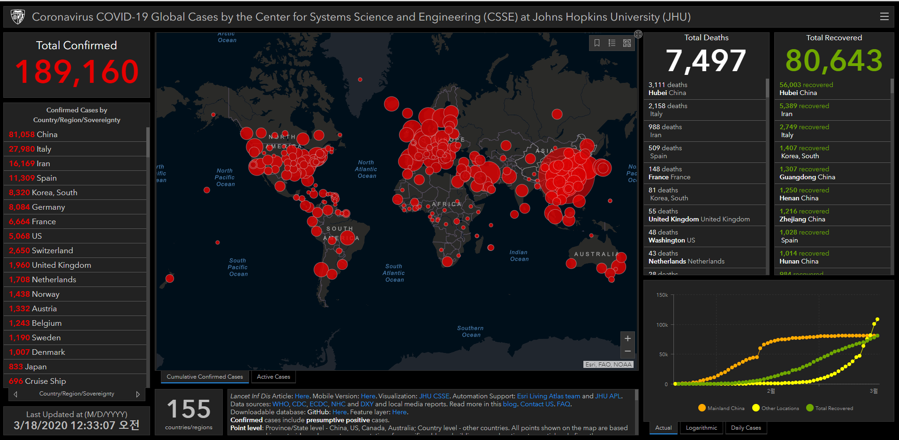

## 배경
2019 년 12 월 31 일, 세계 보건기구 ( WHO )는 중국 후베이 성 우한시 (중국 1,100 만 명의 인구가있는 도시)에서 발견 된 “알 수 없는 원인의 폐렴”이 발생했다는 정보를 받았습니다. 1 월 23 일 현재 , 중국의 20 개 지역 및 9 개 국가 / 지역의 사례를 포함하여 전 세계적으로 확인 된 2019-nCoV 사례 는 800 건이 넘습니다. 12 월 8 일 초에 증상을 보인 최초의 감염된 개인 은 우한 남 중국 해산물 시장의 정점 보유자 인 것으로 밝혀졌다. 그 후 1 월 1 일에 습식 시장이 문을 닫았습니다.이 바이러스를 발생시킨 바이러스는 새로운 코로나 바이러스로 판명되었습니다.. 1 월 10 일, 유전자 시퀀싱 은 중동 호흡기 증후군 바이러스 (MERS-CoV) 및 중증 급성 호흡기 증후군 바이러스 (SARSCoV)와 관련된 새로운 우한 코로나 바이러스, 즉 2019-nCoV , 베타 코로나 바이러스로 결정했습니다 . 그러나, 2019-nCoV의 사망률 및 투과율은 여전히   알려져 있지 않으며, 이전에 참조 된 코로나 바이러스의 사망률과 다를 수 있습니다.

감염된 여행자 (주로 공기)는 우한 이외의 지역에 바이러스가 유입 된 것으로 알려져 있습니다. 1 월 13 일 태국 은 중국 이외의 첫 국제 사건을보고했으며, 중국 이외의 첫 번째 사건 은 1 월 19 일 광동과 베이징에서보고되었다. 1 월 20 일, 중국 국가 보건위원회 (NHC)는 코로나 바이러스가 사람 사이에 전염 될 수 있음을 확인했습니다 . 같은 날 2019-nCoV에 감염된 사람도 일본 과 한국 에서 확인되었으며 다음 날 미국 과 대만에서 확인되었습니다. 우한에서 돌아 오는 여행자에서 발견되었습니다. 1 월 21 일 중국의 여러 주에서 새로운 사례 가보고 되었으며 15 명의 의료 종사자 에서 감염이 확인되었으며 6 명이 사망했습니다. 홍콩 ,  마카오 , 싱가포르 및 베트남 에서 추가 여행 사례가 확인되었습니다 . 1 월 22 일, WHO 비상위원회는이 발병이 국제 보건 규정 (International Health Regulations )에 따라 국제 우려 의 공중 보건 비상 사태  ( PHEIC )  로 분류되어야하는지 여부를 논의하기 위해 소집  되었지만  , 선언 에 대한 결정 을 내리기 전에 정보 부족으로 결정되지 않았습니다 .

1 월 24 일 중국의 설날 을 축하하기 위해 많은 여행 량과 대규모 모임으로 인한 추가 전송의 위험이 즉각적인 관심의 대상입니다 . 중국 내에서 지역 전송을 완화하려는 시도로, 전례없는 전염병 통제 전략이 (처음에) 3 개 도시에서 구현되었습니다. 2020 년 1 월 23 일, 우한은 모든 대중 교통 및 항공 여행을 중단하고 (도시 안팎으로) 1,100 만 명의 도시 주민을 검역소에 보관했습니다 . 1 월 24 일, 무한에 인접한 도시인 황강 (Huanggang)과에 저우 (Ezhou )도 비슷한 검역소에 배치 될 예정이다. 또한 많은 도시들이 구정 행사를 취소했습니다.

우한은 중국 중부의 주요 항공 운송 허브이기 때문에 국제적 확산을 완화하기 위해 전 세계적으로 다양한 조치를 취했습니다. 1 월 1 일 홍콩과 마카오에서 우한에서 출발하는 승객의 대상 공항 검진이 시작되었습니다. 대만, 싱가포르, 태국은 1 월 3 일에 도착하는 승객을 선별하기 시작 했다. 미국에서 CDC는 우한에서 2020 년 1 월 17 일에 3 개의 주요 입항 항으로 직항 및 연결 항공편을 통해 승객의 입국 심사를 시작했다. 첨가되는. 1 월 23 일, 미국 CDC는 중국 우한에 대한 여행 통지를 최고 3 단계로 높였습니다. 말레이시아, 스리랑카, 방글라데시 및 인도를 포함한 추가 태평양 및 아시아 국가들도 이제 공항에서 대상 승객 검열을 수행하고 있습니다.

## GIS 대시 보드  (2020 년 2 월 11 일 업데이트)
이 지속적인 공중 보건 비상 사태에 대응하여, 우리 는 Johns Hopkins University의 시스템 과학 및 엔지니어링 센터 (CSSE)에서 호스팅 하는 대화식 웹 기반 대시 보드 (위의 정적 스냅 샷)를 개발하여 보고 된 사례를 실시간으로 시각화하고 추적합니다. . 1 월 22 일에 처음 공개 된 대시 보드는 영향을받는 모든 국가의 확인 된 COVID-19 사례, 사망 및 회복의 위치와 수를 보여줍니다. 연구자, 공중 보건 당국 및 일반인에게 확산이 발생할 때 발생하는 상황을 추적 할 수있는 사용자 친화적 인 도구를 제공하기 위해 개발되었습니다. 또한 수집 및 표시되는 모든 데이터는 이제 GitHub 리포지토리 에서 초기에 Google 시트로 자유롭게 사용할 수 있습니다.ESRI Living Atlas에 포함 된 대시 보드의 기능 레이어와 함께.

이 대시 보드는 중국의 지방 수준, 미국, 호주 및 캐나다의 도시 수준 및 기타 국가 수준의 사례를보고합니다. 1 월 22 일부터 31 일까지 전체 데이터 수집 및 처리가 수동으로 관리되었습니다. 이 기간 동안 업데이트 횟수는 일반적으로 아침과 밤 모두 (동부 표준시) 하루에 두 번 수행되었습니다. 확산이 진행됨에 따라 수동보고 프로세스를 유지할 수 없게되었고 2 월 1 일에 반자동 리빙 데이터 스트림 전략을 채택했습니다. 우리의 주요 데이터 소스는 DXY입니다중국 의료 커뮤니티 회원이 운영하는 온라인 플랫폼으로, 지역 미디어 및 정부 보고서를 집계하여 COVID-19 누적 사례 총계를 중국의 지방 수준 및 그 밖의 국가 수준에서 거의 실시간으로 제공합니다. 15 분마다 누적 사례 수는 중국 및 영향을받는 국가 및 지역의 모든 주에 대해 DXY에서 업데이트됩니다. 홍콩, 마카오 및 대만을 포함한 중국 본토 이외의 국가 및 지역의 경우 DXY 누적 사례 수가 다른 출처보다 자주 뒤처지는 것으로 나타났습니다. 따라서 새로운 사례가 식별되는 하루 종일 이러한 사례 번호를 수동으로 업데이트합니다. 새로운 사례를 식별하기 위해 다양한 트위터 피드, 온라인 뉴스 서비스 및 대시 보드를 통해 전송 된 직접 통신을 모니터링합니다. 대시 보드를 수동으로 업데이트하기 전에CCDC ), 홍콩 보건국 , 마카오 정부 , 대만 CDC , 유럽 CDC ( ECDC ), 세계 보건기구 ( WHO ) 및 도시 및 주 차원의 보건 당국. 2 월 1 일부터보고를 시작한 미국, 호주 및 캐나다의 도시 수준 사례 보고서의 경우 미국 CDC , 캐나다 정부 , 호주 정부 보건부 및 다양한 주 또는 테리토리 보건 당국에 의존합니다. 모든 수동 업데이트 (중국 본토 외부)는 JHU 팀이 조정합니다.

현재이 새로운 발생에 대한 추가 모델링을 진행 중이며이 블로그 게시물을 곧 결과로 업데이트 할 예정입니다.

# 관련 Github
## 각종 데이터들
- https://github.com/CSSEGISandData/COVID-19
- https://github.com/pcm-dpc/COVID-19

## 중국 데이터들
- https://github.com/BlankerL/DXY-COVID-19-Data
- https://github.com/BlankerL/DXY-COVID-19-Crawler
- https://github.com/kaz-ogiwara/covid19
- https://github.com/tokyo-metropolitan-gov/covid19
